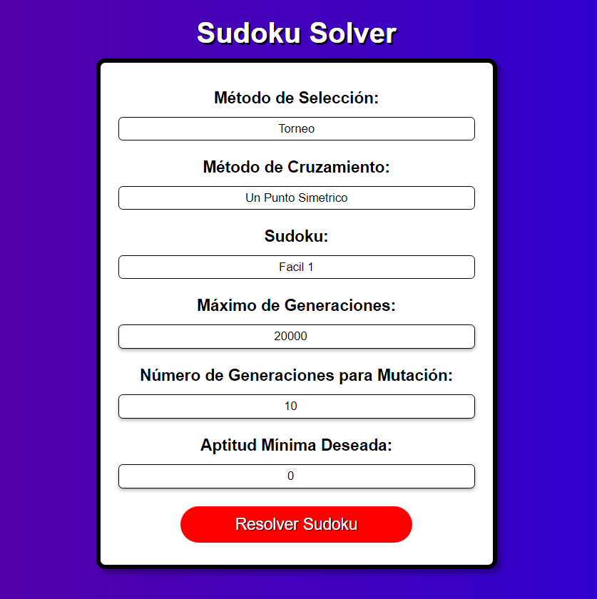
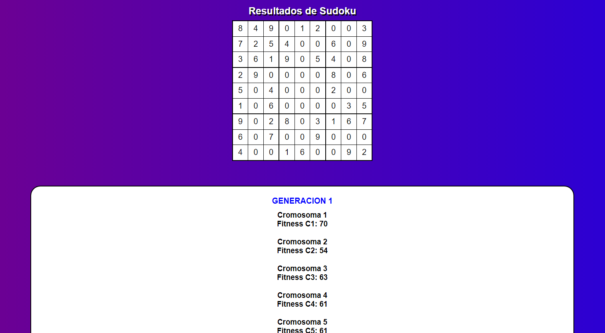
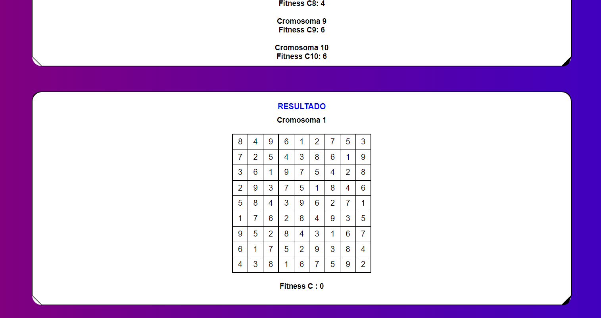

# SUDOKU - Algorimos Genéticos

Proyecto para el curso de inteligencia artificial como parte del aprendizaje en el funcionamiento de algoritmos genéticos los cuales buscan encontrar la solución más óptima a un problema mediante la codificación de poblaciones y cromosomas, en este caso el problema es un sudoku de 9x9 los cuales son grabados previamente en el sistema y que el usuario puede escoger entre diferentes dificultades.

## Tecnologias Utillizadas

- HTML
- CSS
- PHP
- JavaScript

## Capturas de Pantalla

### Formulario de Entrada de Parametros

### Vista previa del sudoku seleccionado 

### Solución del Soduku con la aptitud maxima encontrada

## Mejores Resultados

| Metodo de Selección | Metodo de Cruce   | Generaciones para Mutación | Generaciones para Solución |
|---------------------|-------------------|----------------------------|----------------------------|
| Elite               | Un punto Simetrico| 1                          | 652 |
| Elite               | Un punto Simetrico| 1                          | 930 |
| Elite               | Un punto Simetrico| 1                          | 4244 |
| Elite               | Un punto Simetrico| 1                          | 8813 |
| Torneo              | Un punto Simetrico| 10                         | 10,981 |
| Torneo              | Un punto Simetrico| 10                         | 22,331 |
| Torneo              | Un punto Simetrico| 10                         | 9,681  |
| Torneo              | Un punto Simetrico| 10                         | 9,851 |
| Torneo              | Un punto Simetrico| 10                         | 17,251 |
| Torneo              | Un punto Simetrico| 10                         | 9,771 |
| Torneo              | Dos puntos Asimetrico| 10                      | 11,711 |
| Torneo              | Dos puntos Asimetrico| 10                      | 3,671 |
| Torneo              | Dos puntos Asimetrico| 10                      | 17,111 |
| Generacional        | Un punto Simetrico| 10                          | 7,792 |
